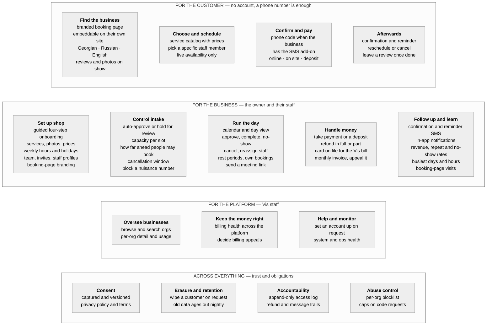
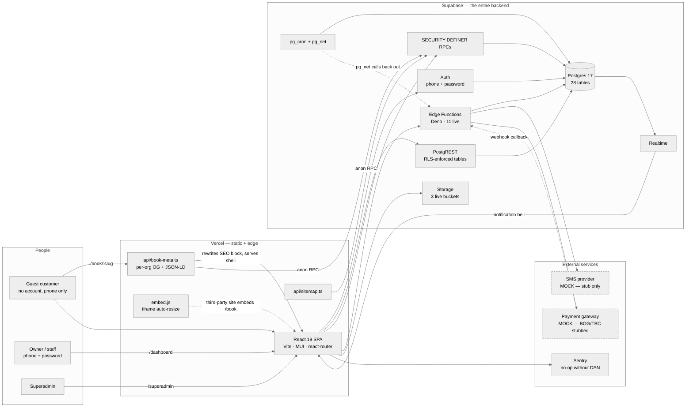
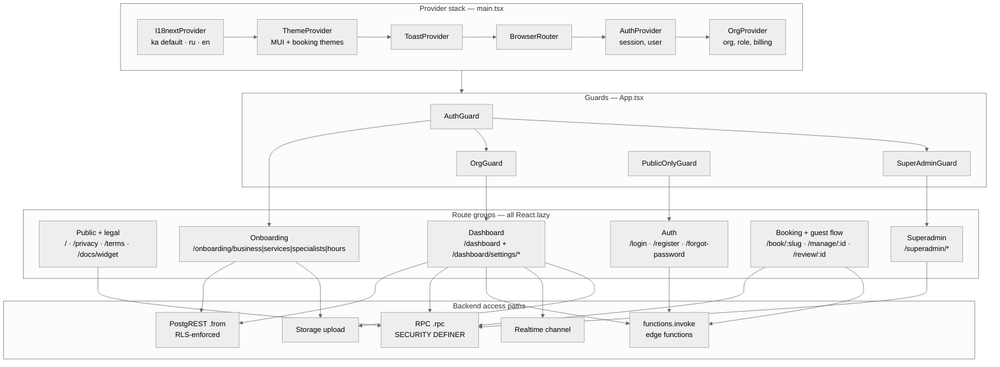
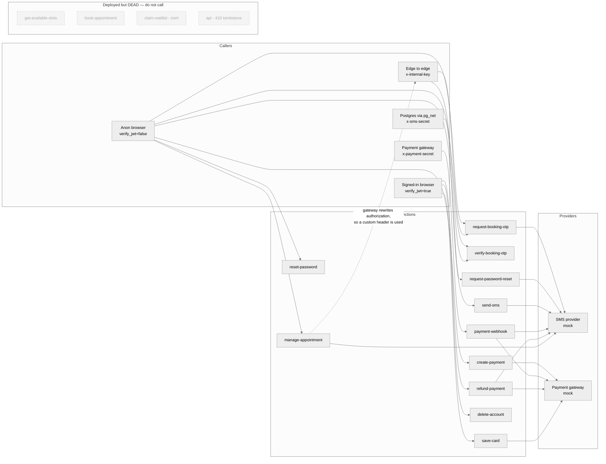
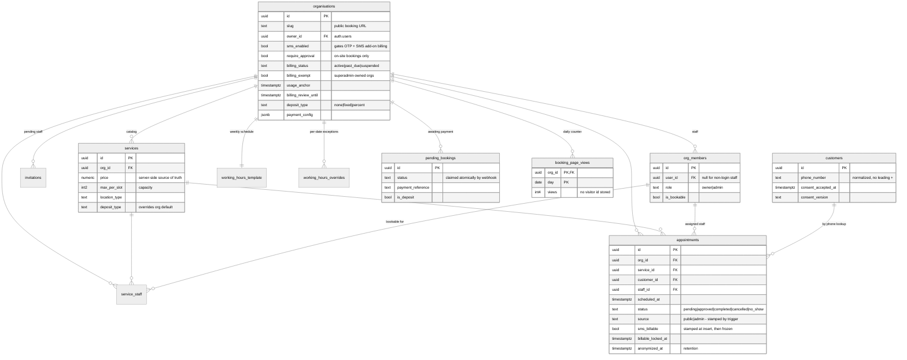
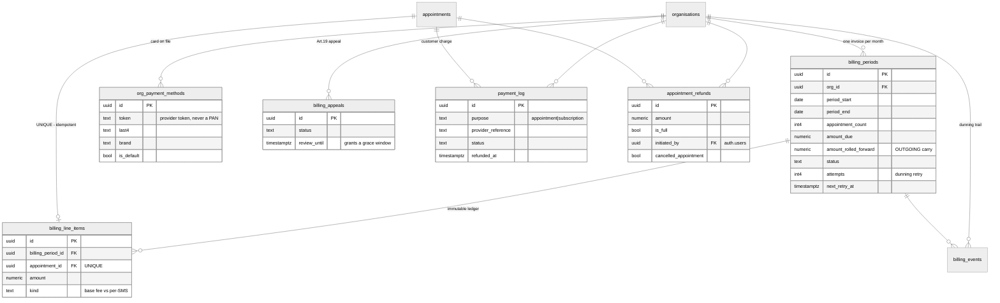
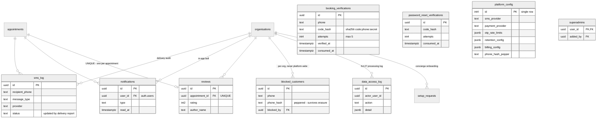
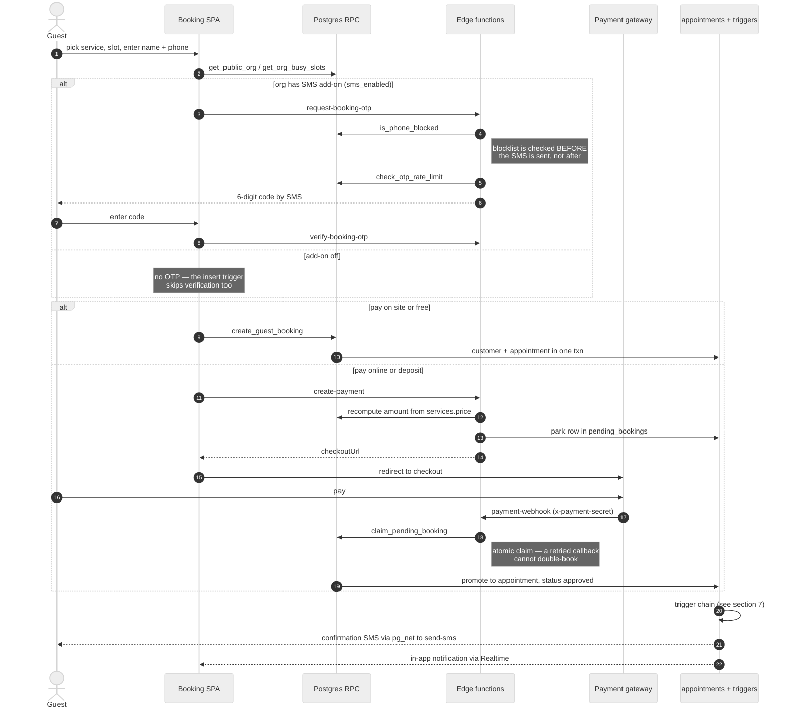
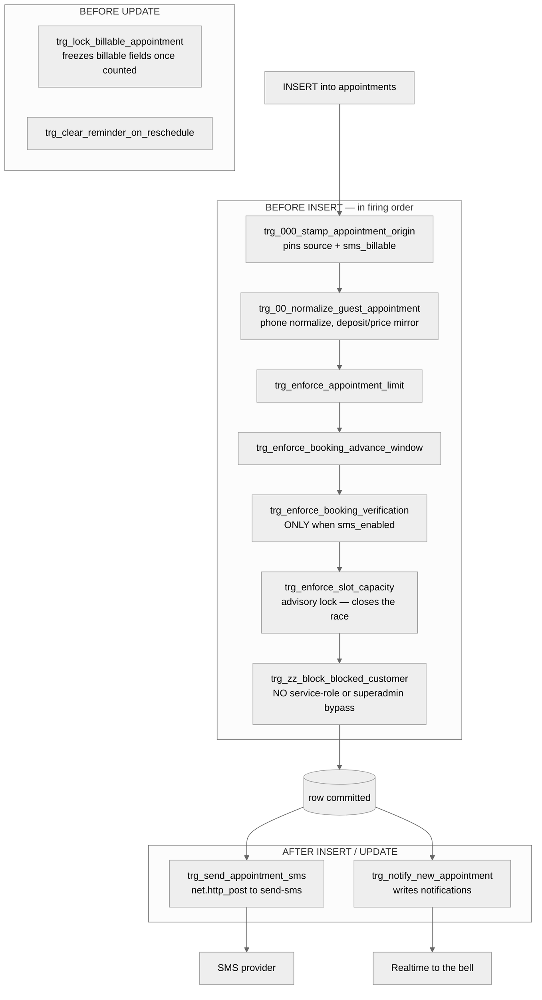

# Vis — Architecture

> Visual companion to [APP_OVERVIEW.md](APP_OVERVIEW.md). That document explains **what** each
> part does and why; this one shows **how the parts connect**. Where a section needs prose detail
> it links there rather than repeating it.
>
> **Verified against the live project** `dnmecnpugjxkjonqsfxx` on **2026-08-31** — tables, edge
> functions, cron jobs and triggers below were read from the running database and the deployed
> function list, not reconstructed from migrations.
>
> Note: [`supabase/README.md`](../supabase/README.md) is stale (it still describes `slots`,
> `subscription_payments` and a `receipts` bucket, none of which exist). Trust this file over it.

**Contents**
1. [What the app does](#1-what-the-app-does) — the functional map
2. [System context](#2-system-context)
3. [Client structure](#3-client-structure)
4. [Edge functions and their callers](#4-edge-functions-and-their-callers)
5. [Database](#5-database) — [tenancy & booking](#5a-tenancy-catalog-and-booking) · [billing](#5b-billing-and-payments) · [comms, compliance, platform](#5c-comms-compliance-and-platform)
6. [Guest booking, end to end](#6-guest-booking-end-to-end)
7. [Async work — cron and triggers](#7-async-work--cron-and-triggers)

---

## 1. What the app does

Before the wiring: the product surface, grouped by **who it serves**. Everything drawn here is
built and shipped. Two capabilities are conditional rather than universal — phone verification and
outgoing SMS only happen for a business that has bought the SMS add-on, which is off by default,
and manual approval is opt-in and applies to on-site bookings only.

**Worth knowing**

- The customer never makes an account. A booking needs a name and a phone number, and the same
  phone is what later proves identity for a reschedule, a cancellation or a review.
- **Bookings are not owner-only or customer-only.** Most arrive through the public page, but the
  owner can also add one from the calendar; the two are distinguished at insert by
  `appointments.source`, because they bill differently.
- Money moves in two independent directions: the **customer pays the business** for an appointment,
  and separately the **business pays Vis** a monthly post-paid bill. They share a payment provider
  seam but nothing else — see §5b.
- What is *not* here, by design: no marketplace or cross-business search, no customer accounts or
  loyalty scheme, no recurring appointments, no public REST API. Several of these existed once and
  were deliberately removed; see [APP_OVERVIEW.md](APP_OVERVIEW.md) for that history.

---

## 2. System context

Two facts shape everything below. First, **there is no separate application server** — the React
SPA talks straight to Supabase, and all server-side logic lives either in Postgres (RLS, SECURITY
DEFINER RPCs, triggers) or in Deno edge functions. Second, **both external providers are `mock` in
production today**: `bog.ts` / `tbc.ts` and the `smsoffice` SMS case are stubs that throw
`provider_not_configured`, and the factory fails closed on an unknown provider name.

**Worth knowing**

- The database calls the edge functions *back out* over HTTP via `pg_net` — the `cron -.-> fns`
  edge is not decoration. SMS is dispatched by a trigger, not by the client.
- `/book/:slug` is served by a Vercel edge function that rewrites an SEO block inside the SPA
  shell, so the public booking page is crawlable. It falls back to the untouched shell on any
  Supabase error and only 404s on a confirmed-missing org.
- `frame-ancestors *` is set for `/book/*` only, because that route is embeddable; everything else
  is `'self'` plus `X-Frame-Options`. See `client/vercel.json`.

---

## 3. Client structure

Four guards over six route groups. The useful part of this diagram is the **right-hand column**:
which backend access path each group uses. Most dashboard reads are plain PostgREST against
RLS-protected tables; anything crossing a tenant boundary, touching money, or needing to run as a
privileged role goes through an RPC or an edge function instead.

**Worth knowing**

- [`client/src/lib/supabase.ts`](../client/src/lib/supabase.ts) creates **two** clients. The second
  is a throwaway with `persistSession: false` and its own `storageKey`, used only by
  `checkCredentials()` so the login password pre-check does not mint a session before the OTP step
  has passed.
- **Realtime is used in exactly one place** — [`useNotifications.ts`](../client/src/hooks/useNotifications.ts),
  channel `notifications:${user.id}`. Nothing else subscribes.
- Superadmin pages never read tenant tables directly; every one of them goes through a
  `platform_*` / `list_*` RPC that also writes to `data_access_log`.
- Tables the client touches directly: `organisations`, `org_members`, `services`, `service_staff`,
  `working_hours_template`, `working_hours_overrides`, `appointments`, `invitations`,
  `setup_requests`, `blocked_customers`, `notifications`, `billing_periods`, `billing_appeals`,
  `appointment_refunds`, `data_access_log`.

---

## 4. Edge functions and their callers

The middleware layer: 11 live Deno functions. What makes this layer awkward to reason about is
that it has **five different classes of caller**, each authenticated differently — including the
database itself, which calls out over HTTP through `pg_net`.

**Worth knowing**

- **Four functions are still `ACTIVE` in the Supabase dashboard but dead in the code**:
  `get-available-slots`, `book-appointment`, `claim-waitlist` and `api` (the withdrawn public REST
  API, now a 410 tombstone). They are listed here precisely so nobody wires something to them.
  They are pending manual deletion from the dashboard.
- `manage-appointment` calls `request-booking-otp` / `verify-booking-otp` **server to server** and
  must pass `x-internal-key` rather than `authorization` — the functions gateway rewrites the
  `authorization` header on internal calls, so a bearer token would not survive the hop.
- `payment-webhook` has a **mock branch that is a deliberate dev backdoor**, double-gated on
  `ALLOW_MOCK_PAYMENTS=true`. It must be unset before launch.
- `verify-booking-otp` accepts the test code `000000` when `ALLOW_TEST_OTP` /
  `ALLOW_TEST_OTP_HOSTED` are set. `reset-password` has **no** such bypass, by design.
- `create-payment` recomputes the amount server-side from `services.price`; the client's number is
  never trusted.
- Provider resolution order for both seams: env var → `platform_config.payment_provider` /
  `.sms_provider` → `mock`. An unrecognised name **fails closed** rather than defaulting.

---

## 5. Database

28 live tables, every one with RLS enabled. `organisations` is the tenancy root — almost everything
carries an `org_id` FK back to it, and the RLS policies are built on the SECURITY DEFINER helpers
`get_user_org_ids()` / `get_user_org_role()`.

Split into three diagrams by domain, because 28 tables on one canvas is unreadable. Columns shown
are primary keys, foreign keys, and the ones that **carry behaviour** — not the full column list.

### 5a. Tenancy, catalog and booking

**Worth knowing**

- `org_members.user_id` is **nullable** — non-login staff exist. Anything fanning out over members
  must tolerate that; a `NOT NULL` assumption here once silenced every notification for affected
  orgs.
- `pending_bookings` is the parking lot for online bookings that have not been paid for yet. It is
  written and read **only** by the payment edge functions via the service role, and promoted into a
  real `appointments` row by `payment-webhook`.
- `booking_page_views` stores a per-org **daily counter and nothing else** — no visitor id, no IP.
  Deduplication happens in the browser. Anon can write via RPC but cannot read.
- `appointments.source` and `sms_billable` are stamped by `trg_000_stamp_appointment_origin` at
  insert, so a client cannot claim `admin` to dodge the per-SMS fee.

### 5b. Billing and payments

Post-paid: usage accrues through the month, `billing-close` cuts an invoice, `billing-charge`
charges the card on file. Pricing is flat ₾15/month plus ₾0.7 per SMS-billable appointment.

**Worth knowing**

- `billing_line_items.appointment_id` is **UNIQUE** — that is what keeps the close job idempotent
  if it runs twice.
- `amount_rolled_forward` is the **outgoing** carry to the *next* period, not an incoming balance.
  Reading it the other way inverts a month's invoice.
- `payment_log` is superadmin-only because it also holds platform subscription charges;
  `appointment_refunds` is the org-readable view of refund activity.
- Only appointments in `('approved','completed','no_show')` are counted, so a `pending` request
  costs the business nothing until it is approved.
- **The org itself cannot write any of the billing fields on `organisations`** — see
  `trg_prevent_billing_self_update` in §7.

### 5c. Comms, compliance and platform

**Worth knowing**

- `blocked_customers` stores a **peppered hash** alongside the phone, so erasing a customer's data
  does not silently unblock them.
- `data_access_log` is **append-only**: no INSERT/UPDATE/DELETE policy exists, so only SECURITY
  DEFINER functions can write and the history cannot be edited. It covers superadmin RPCs; direct
  PostgREST reads are a documented residual — see [PROCESSING_RECORD.md](PROCESSING_RECORD.md).
- The two OTP tables are structurally identical but deliberately separate: booking verification and
  password recovery must not share an attempt budget.
- `platform_config` is a single row holding provider selection, rate limits, retention windows and
  the phone-hash pepper. `otp_rate_limits` currently holds **relaxed test values** that must be
  reset before launch.

### Storage buckets

| Bucket | Public | Limit | Note |
|---|---|---|---|
| `logos` | yes | 2 MB | org logo + `{org_id}/cover.{ext}` |
| `member-photos` | yes | 2 MB | staff avatars |
| `service-images` | yes | 5 MB | per-service galleries |
| `catalog-images` | yes | 5 MB | **orphaned** — policies dropped, pending manual deletion |

Write policies are org-folder-scoped: the first path segment must be an org id the caller belongs
to, via `get_user_org_ids()`, with a superadmin override.

---

## 6. Guest booking, end to end

The most tangled path in the system, and the one worth having a picture of. Two branches — on-site
and online — that converge on the same trigger chain. Note that the OTP step is **conditional**:
since `20260903120000` it only runs when the org has bought the SMS add-on
(`organisations.sms_enabled`).

**Worth knowing**

- The **blocklist is checked before the OTP is sent**, so a blocked number never costs an SMS.
- `claim_pending_booking` exists because the original read-then-write idempotency check let a
  retried gateway callback both double-book *and* auto-refund a booking that had succeeded.
- A `pending` (awaiting-approval) booking **does not hold its slot**, so `approve_appointment`
  re-checks capacity under the per-org advisory lock and can legitimately fail with `slot_taken`.
- Anything paid online or carrying a deposit is **always** auto-approved — the money has moved.
  `require_approval` gates on-site bookings only.
- Customers receive exactly two messages: a confirmation on approval, and a morning-of reminder.

---

## 7. Async work — cron and triggers

Everything here runs with nobody watching, and it is where surprises live.

### Scheduled jobs

All six are `active` in `cron.job` as of 2026-08-31.

| Job | Schedule | Calls |
|---|---|---|
| `complete-elapsed-appointments` | `*/5 * * * *` | `complete_elapsed_appointments()` |
| `reject-elapsed-pending` | `*/5 * * * *` | `reject_elapsed_pending_appointments()` |
| `dispatch-appointment-reminders` | `*/15 * * * *` | `dispatch_appointment_reminders()` → `pg_net` → `send-sms` |
| `billing-close` | `0 3 * * *` | `run_billing_close()` → `close_billing_period_for_org()` |
| `billing-charge` | `30 3 * * *` | `run_usage_charges()` → `charge_billing_period()` + dunning |
| `purge-expired-data` | `30 3 * * *` | `purge_expired_data()` — retention across 9 tables |

### The `appointments` trigger chain

Postgres fires triggers in **alphabetical order by name**, which is why these are named
`trg_000…` through `trg_zz…`. The prefixes are load-bearing: renaming one reorders the chain.

### Guards on other tables

| Table | Trigger | What it protects |
|---|---|---|
| `organisations` | `trg_prevent_billing_self_update` | **The column-level ACL.** Freezes `billing_status`, `billing_exempt`, `usage_anchor`, `owner_id`, `billing_review_until` |
| `organisations` | `trg_pin_org_billing_exempt` | Pins `billing_exempt` at insert |
| `org_members` | `trg_prevent_role_escalation` | Stops a member promoting themselves |
| `org_members` | `trg_enforce_staff_limit` | Seat cap |
| `blocked_customers` | `trg_normalize_blocked_phone`, `trg_set_blocked_customer_hash` | Normalizes and peppers the phone |
| `setup_requests` | `trg_notify_setup_request_completed` | `pg_net` → `send-sms` on completion |

**Worth knowing**

- ⚠️ **`organisations_update` has no column list.** That means `trg_prevent_billing_self_update`
  *is* the column-level access control for the whole table. **Any new sensitive column on
  `organisations` is tenant-writable until it is added to that trigger.**
- `trg_zz_block_blocked_customer` has **no service-role or superadmin bypass** — it applies to
  every caller. That is deliberate.
- `reject-elapsed-pending` is silent by design: the decline SMS fires only on a *human* rejection,
  which the trigger detects by testing `auth.uid()` — the cron sweep has none.
- Reminders were moved off a 24-hour lead to morning-of; see [APP_OVERVIEW.md](APP_OVERVIEW.md).

---

## Where to look next

| Topic | Document |
|---|---|
| What each feature does and why | [APP_OVERVIEW.md](APP_OVERVIEW.md) |
| Blocking items before launch | [SECURITY_PRE_LAUNCH.md](SECURITY_PRE_LAUNCH.md) |
| Turning on a real SMS provider | [SMS_PROVIDER_READINESS.md](SMS_PROVIDER_READINESS.md) |
| Georgian data-protection posture | [COMPLIANCE_GE_DPL.md](COMPLIANCE_GE_DPL.md), [PROCESSING_RECORD.md](PROCESSING_RECORD.md) |
| Incident handling | [BREACH_RUNBOOK.md](BREACH_RUNBOOK.md) |
